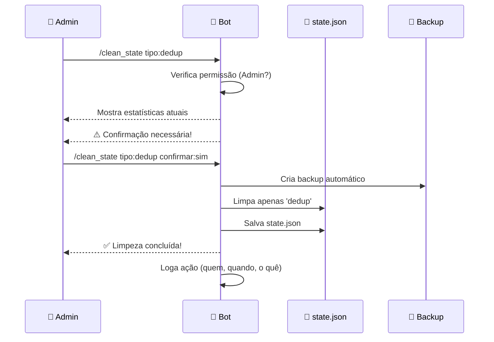

# 🧹 Análise: Comando `/clean_state` - Limpeza do state.json

**Data:** 13 de Fevereiro de 2026  
**Versão:** 2.1 "Mafty Sovereign"

---

## 📊 Estrutura do `state.json`

O arquivo `state.json` contém 4 tipos principais de dados:

| Chave | Tipo | Descrição | Impacto se Limpado |
|-------|------|-----------|-------------------|
| `dedup` | `Dict[str, List[str]]` | Histórico de links já enviados por feed | ⚠️ **Médio** - Repostará notícias recentes |
| `http_cache` | `Dict[str, Dict]` | Cache HTTP (ETags, Last-Modified) | ⚠️ **Baixo** - Mais requisições HTTP, mas sem dados perdidos |
| `html_hashes` | `Dict[str, str]` | Hashes de páginas HTML monitoradas | ⚠️ **Médio** - Detectará mudanças em sites já monitorados |
| `last_cleanup` | `float` | Timestamp da última limpeza automática | ✅ **Nenhum** - Apenas metadado |
| `last_announced_hash` | `str` | Hash do último commit anunciado | ⚠️ **Baixo** - Pode re-anunciar versão |

---

## 🎯 Casos de Uso para `/clean_state`

### ✅ Quando Usar:

1. **Problemas de Deduplicação**
   - Notícias não estão sendo detectadas como novas
   - Histórico corrompido ou inconsistente

2. **Reset de Cache HTTP**
   - Feeds não estão atualizando corretamente
   - Problemas com ETags/Last-Modified

3. **Reset de Monitoramento HTML**
   - Sites HTML não estão detectando mudanças
   - Hash inicial incorreto

4. **Manutenção Preventiva**
   - Arquivo muito grande (>10MB)
   - Performance degradada

5. **Testes e Debug**
   - Resetar estado para testes
   - Verificar comportamento sem cache

---

## ⚠️ Riscos e Considerações

### 🔴 Riscos Altos:

1. **Repostagem de Notícias**
   - Limpar `dedup` fará o bot repostar notícias já enviadas
   - Pode causar spam no canal Discord

2. **Perda de Cache HTTP**
   - Mais requisições HTTP = possível rate limiting
   - Aumento de tráfego de rede

3. **Re-detecção de Mudanças HTML**
   - Sites HTML serão detectados como "mudados" novamente
   - Pode gerar notificações falsas

### 🟡 Mitigações Necessárias:

1. ✅ **Confirmação Dupla** - Requer confirmação explícita
2. ✅ **Backup Automático** - Criar backup antes de limpar
3. ✅ **Opções Granulares** - Permitir limpar apenas partes específicas
4. ✅ **Estatísticas Antes/Depois** - Mostrar impacto da limpeza
5. ✅ **Logging Detalhado** - Registrar quem limpou e quando
6. ✅ **Permissão de Admin** - Apenas administradores podem usar

---

## 🛠️ Implementação Proposta

### Estrutura do Comando:

```python
/clean_state [tipo: dedup|http_cache|html_hashes|tudo] [confirmar: sim/não]
```

### Opções de Limpeza:

1. **`dedup`** - Limpa apenas histórico de deduplicação
   - **Seguro:** Não afeta cache HTTP
   - **Risco:** Repostará notícias recentes

2. **`http_cache`** - Limpa apenas cache HTTP
   - **Seguro:** Não afeta deduplicação
   - **Risco:** Mais requisições HTTP

3. **`html_hashes`** - Limpa apenas hashes HTML
   - **Seguro:** Não afeta feeds RSS
   - **Risco:** Re-detectará mudanças em sites HTML

4. **`tudo`** - Limpa tudo (exceto `last_cleanup`)
   - **Risco:** Todos os riscos acima combinados
   - **Uso:** Apenas em casos extremos

### Fluxo de Execução:



---

## 📋 Especificação Técnica

### Validações:

1. ✅ Verificar permissão de administrador
2. ✅ Validar tipo de limpeza escolhido
3. ✅ Mostrar estatísticas antes de confirmar
4. ✅ Criar backup automático
5. ✅ Validar que state.json existe e é válido
6. ✅ Tratar erros de I/O

### Estatísticas a Mostrar:

```python
Estatísticas do state.json:
- dedup: 15 feeds, 1.234 links únicos
- http_cache: 33 URLs em cache
- html_hashes: 8 sites monitorados
- Tamanho do arquivo: 245 KB
- Última limpeza: 2 dias atrás
```

### Backup Automático:

```python
backup_file = f"backups/state_backup_{timestamp}.json"
# Copia state.json para backup antes de limpar
```

---

## 🔒 Segurança

### Proteções Implementadas:

1. ✅ **Permissão de Admin** - `@app_commands.checks.has_permissions(administrator=True)`
2. ✅ **Confirmação Dupla** - Requer confirmação explícita
3. ✅ **Backup Automático** - Sempre cria backup antes
4. ✅ **Logging de Auditoria** - Registra quem limpou e quando
5. ✅ **Validação de Entrada** - Valida tipo de limpeza
6. ✅ **Tratamento de Erros** - Não quebra o bot se falhar

### Logs de Auditoria:

```
[AUDIT] STATE_CLEANED | User: Admin#1234 | Guild: 417746665219424277 | 
Type: dedup | Backup: state_backup_20260213_152630.json | 
Stats Before: {dedup: 1234 links, http_cache: 33 URLs} | 
Stats After: {dedup: 0 links, http_cache: 33 URLs}
```

---

## 💡 Benefícios

1. ✅ **Manutenção Facilitada** - Não precisa editar JSON manualmente
2. ✅ **Segurança** - Backup automático e confirmação
3. ✅ **Flexibilidade** - Limpar apenas o necessário
4. ✅ **Transparência** - Estatísticas antes/depois
5. ✅ **Auditoria** - Logs de quem fez o quê

---

## 🚀 Implementação Recomendada

**Prioridade:** 🟡 MÉDIA  
**Complexidade:** 🟢 BAIXA  
**Risco:** 🟡 MÉDIO (com mitigações adequadas)

**Tempo Estimado:** 2-3 horas

**Arquivos a Modificar:**
- `bot/cogs/admin.py` - Adicionar comando
- `utils/storage.py` - Função de backup
- `core/scanner.py` - Função auxiliar para estatísticas

---

## ✅ Conclusão

O comando `/clean_state` é **viável e recomendado**, desde que:

1. ✅ Implementado com todas as proteções de segurança
2. ✅ Requer confirmação explícita
3. ✅ Cria backup automático
4. ✅ Mostra estatísticas antes de limpar
5. ✅ Loga todas as ações
6. ✅ Permite limpeza granular (não apenas tudo)

**Recomendação:** ✅ **IMPLEMENTAR** com todas as proteções descritas.
